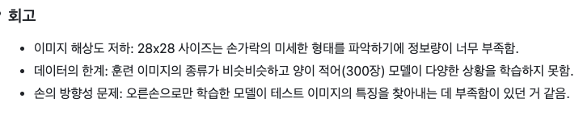

# AIFFEL Campus Online Code Peer Review Templete
- 코더 : 차병곤
- 리뷰어 : 정범준


# PRT(Peer Review Template)
- [x]  **1. 주어진 문제를 해결하는 완성된 코드가 제출되었나요?**
    - 이미지를 보고 가위/바위/보를 분류하는 모델을 잘 구현하였다.
    
- [x]  **2. 전체 코드에서 가장 핵심적이거나 가장 복잡하고 이해하기 어려운 부분에 작성된 
주석 또는 doc string을 보고 해당 코드가 잘 이해되었나요?**
    - 셀마다 무엇을 했는지 주석이 잘 정리되어 있다.
        
- [x]  **3. 에러가 난 부분을 디버깅하여 문제를 해결한 기록을 남겼거나
새로운 시도 또는 추가 실험을 수행해봤나요?**
    - 개선을 위해 모델의 파라미터를 수정하였다.
        
- [x]  **4. 회고를 잘 작성했나요?**
    - 원하는 결과가 나오지 않은 것에 대한 자세한 회고를 작성하엿다.
    - 
    - (제가 이 파일에 쓴 회고가 아니라 캡쳐한 병곤님 회고입니다) 
        
- [x]  **5. 코드가 간결하고 효율적인가요?**
    - 코드가 효율적이고 보기 좋게 정리되어있다.
    


# 회고(참고 링크 및 코드 개선)
```
결과 분석을 자세히 하셨던데 나도 다음에 조금 더 꼼꼼히 해야겠다
```
